# KaboomMenu.Docs

- [KaboomMenu.Docs](#kaboommenudocs)
  - [1. Početak](#1-početak)
    - [1.1. O aplikaciji](#11-o-aplikaciji)
    - [1.2. Uloge korisnika i njihov opis](#12-uloge-korisnika-i-njihov-opis)
  - [2. Potrebne specifikacije](#2-potrebne-specifikacije)
  - [3. Priručnik za korisnike](#3-priručnik-za-korisnike)
    - [3.1. Poruka dobrodošlice](#31-poruka-dobrodošlice)
    - [3.2. Prijava u korisnički račun](#32-prijava-u-korisnički-račun)
    - [3.3. Postavke korisničkog računa](#33-postavke-korisničkog-računa)
    - [3.4. Popis stranica](#34-popis-stranica)
      - [3.4.1.  Uređivanje podataka o korisniku, tvrtkama i lokacijama](#341--uređivanje-podataka-o-korisniku-tvrtkama-i-lokacijama)
      - [3.4.2. Upravljanje cjenicima jedne lokacije](#342-upravljanje-cjenicima-jedne-lokacije)
      - [3.4.4. Upravljanje i uređivanje pojedinačnog cjenika](#344-upravljanje-i-uređivanje-pojedinačnog-cjenika)
      - [3.4.5. Menu](#345-menu)
  - [4. Izvedba projekta](#4-izvedba-projekta)
    - [4.1. Korišteni alati i tehnologije](#41-korišteni-alati-i-tehnologije)
    - [4.2. Arhitektira i implementacija projekta](#42-arhitektira-i-implementacija-projekta)
      - [4.2.1. Baza podataka](#421-baza-podataka)
      - [4.2.2. ViewModel](#422-viewmodel)
  - [5. Zaključak](#5-zaključak)

## 1. Početak
### 1.1. O aplikaciji
Kaboom Menu je web-aplikacija koja omogućuje pregled, plaćanje i/ili naručivanje hrane i pića u ugostiteljskim objektima pomoću beskontaktnih QR kodova na cjenicima, a vlasnicima objekata omogućuje uređivanje cjenika.

Aplikacija rješava problem nedostatka gotovine i olakšava odabir hrane i pića prilikom dolaska u restorane, čime se osigurava točnost narudžbe. QR kod omogućuje pristup cjeniku na svakom stolu. Nakon pokretanja web-aplikacije, prikazat će se cjenik restorana, a daljnjim odabirom hrane ili pića bit će moguće vidjeti sastojke i detaljniji opis te će se ponuditi mogućnost naručivanja. Kod narudžbe za vlastiti stol, postojat će dvije opcije: plaćanje karticom putem Stripea, Apple Pay-a ili Google Pay-a te plaćanje gotovinom.

Za vlasnike ugostiteljskih objekata aplikacija ubrzava protok posjetitelja jer smanjuje kretanje konobara, što znači da je potrebno manje konobara za veće ugostiteljske objekte. Dodatno, u skorijim verzijama, olakšavat će konobarima posao jer nije potrebno pamtiti narudžbe kao ni zapisivati(jer će sve biti vidljivo na zaslonu i prikazano user-friendly). Kaboom Menu pomoći će ugostiteljskim objektima i njihovim radnicima, a isto tako i gostima zbog novog sustava plaćanja u eurima, koji uz veliki broj kovanica može zbuniti korisnike. Ova aplikacija također smanjuje potrebu za gotovinom, što je u bliskoj budućnosti gotovo neizbježno.

U skorijim verzijama, aplikacija će omogućiti korisnicima naručivanje hrane i pića putem Kaboom-a. Ovo će olakšati praćenje napojnica, te će vlasnicima objekata pomoći u praćenju istih, što je od 2023. obavezno za sve ugostiteljske objekte.

Kaboom Menu je idealno rješenje koje je dostupno svima po povoljnoj cijeni.

### 1.2. Uloge korisnika i njihov opis
Pristup aplikaciji će biti moguć kroz 4 uloge - vlasnici ugostiteljskih objekata, ovlašteni zaposlenici objekata, posjetitelji objekata i vlasnici aplikacije Kaboom. Dopuštenja i opis svake od uloga su objašnjena u tablici:

| Uloga | Opis |
|-------|------|
| Owner | Vlasnik ugostiteljskog objekta |
| Admin | Ovlašteni zaposlenici s dopuštenjem promjene cjenika (npr. konobari) |
| User | Posjetitelji ugostiteljskih objekata, pristup samo cjeniku |
| Platform admin | Vlasnici cijele aplikacije sa svim ovlastima |

 

## 2. Potrebne specifikacije
Za korištenje aplikacije svim korisnicima potreban je mobitel. Korisnicima je potrebna kamera koja ima mogućnost skeniranja QR-kodova te pristup internetu.

Vlasnicima ugostiteljskih objekata je potrebna i validna e-mail adresa za kreiranje računa.

## 3. Priručnik za korisnike
Upute za pokretanje stranice

Za pokretanje aplikacije potrebno je otići na web stranicu aplikacije:

https://kaboom.menu

Kliknuti gumb “Login”, zatim “Sign up” i kreirati korisnički račun.

Za korištenje aplikacije možete se referirati na video ili tehničku dokumentaciju na google driveu.

 

jecoyor624@appxapi.com

Pa$$word1

### 3.1. Poruka dobrodošlice

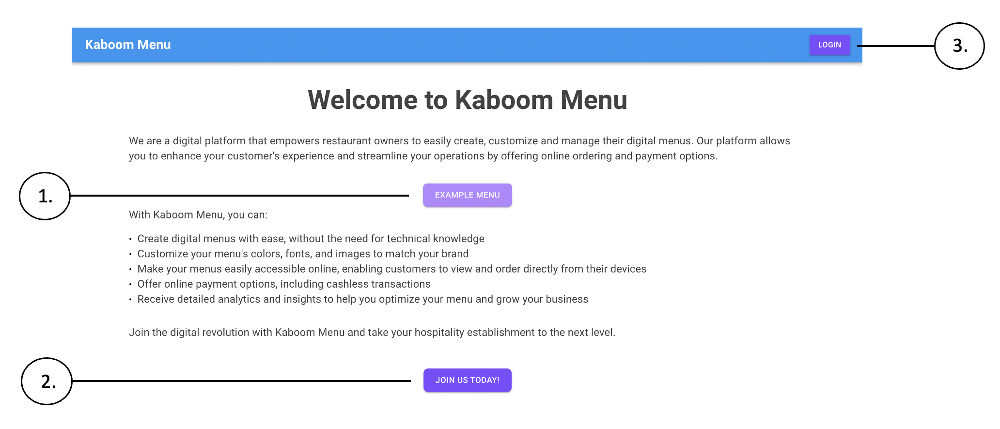

Slika 1. Početna stranica 

Pritiskom na službeni link aplikacije https://kaboom.menu/ , generira se početna stranica(Slika 1). Ovdje su prikazane sve mogućnosti i usluge koje KaboomMenu nudi. Na sredini stranice, nalazi se gumb “EXAMPLE MENU“(1) čijim se odabirom preusmjerava na primjer gotovog cjenika. Na dnu stranice, nalazi se gumb “JOIN US TODAY“(2) čijim se odabirom preusmjerava na stranicu za ispunjavanje podataka korisnika. U gornjem desnom kutu, nalazi se gumb “LOGIN“(3) koji preusmjerava na stranicu za prijavljivanje(slika 2).

### 3.2. Prijava u korisnički račun
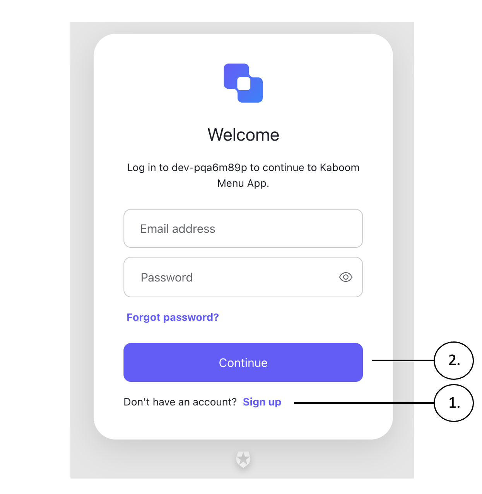

Slika 2. Stranica za prijavljivanje
 
 Korisnik ima dvije mogućnosti: napraviti novi korisnički račun što može odabirom gumba “Sign up“(1) na dnu stranice ili prijaviti se u već postojani korisnički račun upisivanjem postojeće e-mail adrese i odgovarajuće lozinke te pritiskom na gumb “Continue“(2).

### 3.3. Postavke korisničkog računa 
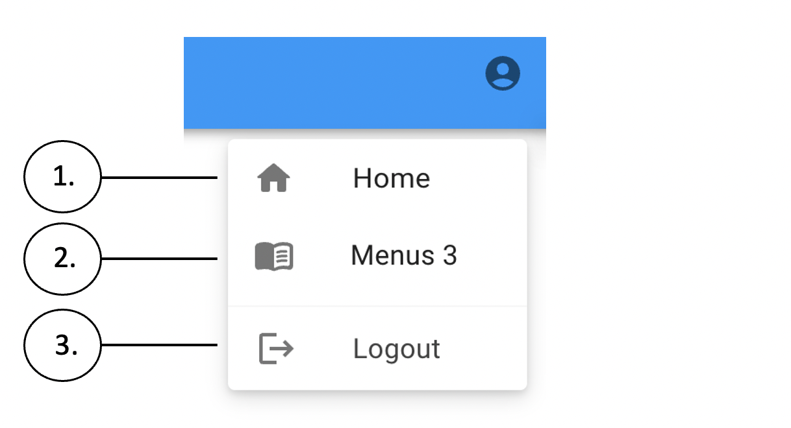

Slika 3. Postavke korisničkog računa

Klikom na avatra u desnom gornjem kutu otvara se User Menu (Slika 3.). U gornjem desnom kutu nakon prijave će se pojaviti ikona s prikazom osobe. Lijevim klikom miša na nju otvara se izbornik. Na njemu je gumb “Home“ (1) koji preusmjerava na stranicu sa podatcima prijavljenog korisnika te pripadnog ugostiteljskog objekta (Slika 5). Gumb “Venus3“ (2) vodi na stranicu navedenog cjenika (Slika 6.). Gumb “Logout“ (3) odjavljuje prijavljenig korisnika te ga vraća na početnu stranicu (Slika 1).

### 3.4. Popis stranica
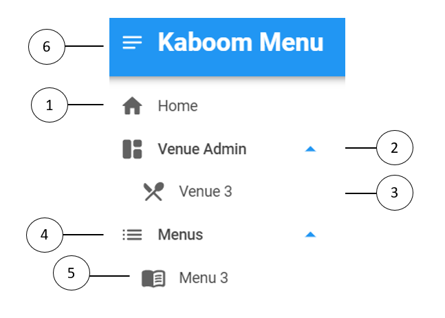

Slika 4. Popis svih odjeljaka

Na lijevoj strani ekrana klikom na menu gumb(6), otvara se popis svih odjeljaka (Slika 4.). Najviši odjeljak “Home“(1) vodi na stranicu na kojoj se upisuje ili su već upisani osobni podatci prijavljenog korisnika, informacije o tvrtki te opis ugostiteljskog objekta (Slika 5). Drugi odjeljak “Venue Admin“(2) sadrži popis svih postojećih venues-a (ugostiteljskih objekata). Ovdje je to na primjer venue Venus3 (3). Klikom na Venue 3 otvara se stranica za uređivanje cjenika te lokacije (Slika 6.). Sljedeći odjeljak prikazuje popis svih menus-a (cjenika) (4) prijavljenog korisnika  kakvog će posjetitelji odgovarajućeg ugostiteljskog objekta vidjeti pri korištenju KaboomMenu-a .  Ovdje je primjer cjenik Menu 3 (5) koji je trenutno aktivan za venue Menus 3.

#### 3.4.1.  Uređivanje podataka o korisniku, tvrtkama i lokacijama
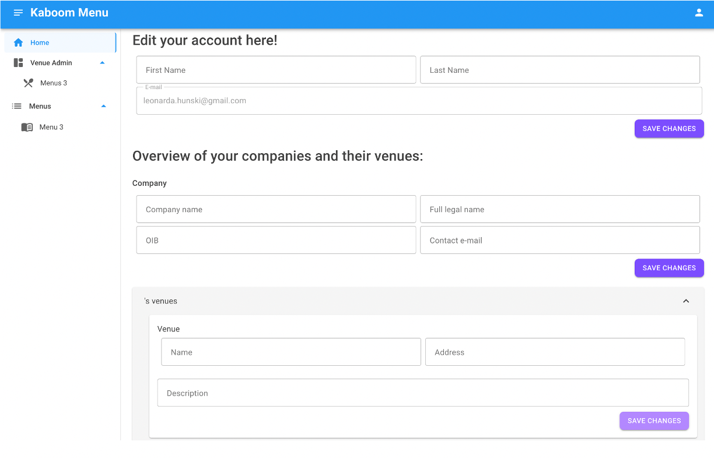

Slika 5. Uređivanje podataka o korisniku, tvrtkama i ugostiteljskim objektima

Na početku stranice je moguće urediti svoje ime i prezime,a promjena e-maila ej onemogućena. Ispod je prikazan popis svih tvrtki i venue (lokacija) za svaku od tvrtku. Za tvrtku je moguće mijenjati naziv firme, legalni naziv, OIB i e-mail. Za svaki venue (lokaciju) je moguće urediti ime, adresu i opis. Nakon svake napravljne promjene je potrebno kliknuti desnim klikom na gumb “save changes” koji je priložen u blizini.

#### 3.4.2. Upravljanje cjenicima jedne lokacije 
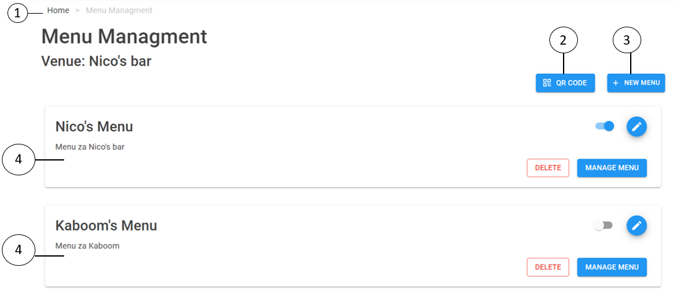

Slika 6. Stranica Menu Managment

Stranica Menu Managment je napravljena za lagano uređivanje svih cjenika neke lokacije. Na vrhu stranice se nalazi popis puta od starnice home do trenutne stranice (1). Ispod piše naziv lokacije za koju se gledaju cjenici. Nakon toga slijedi gumb QR CODE (2) koji će otvorit zasebanu karticu (Slika 7.) koja sadrži generirani kod za aktivni cjenik. Odmah pored je gumb NEW MENU (3) koji otvara zasebnu karticu (Slika 8.) za stvaranje novog cjenika . Ispod su ispisani svi cjenici svaki na svojoj kartici (4) sa svojim imenom i opisom (Slika 9.) . 

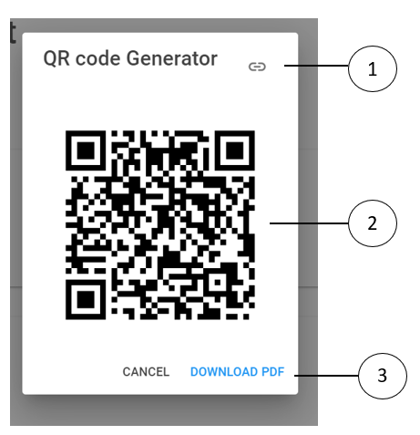

Slika 7. Kartica generiranog QR koda

Na vrhu se nalazi gumb koji vodi do cjenika za kojeg je generiran QR kod (1), QR kod se nalazi odmah ispod(2). Postoji opcija preuzimanja PDF-a s tim QR kodom klikom na gumb DOWNLOAD PDF (3).

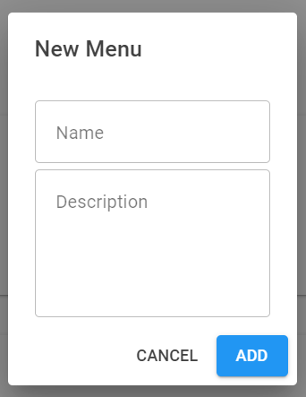

Slika 8. Kartica za stvaranje novog cjenika

Na kartici za stvaranje novog cjenika je potrebno upisati ime i opis cjenika, te nakon toga pritisnuti gumb ADD desnim klikom miša. 

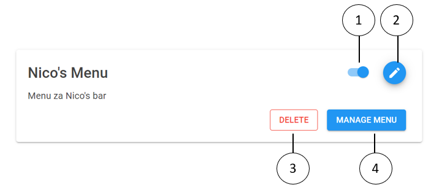

Slika 9. Prikaz cjenika

Za svakom cjeniku se nalazi aktivacijski “switch” (1) koji aktivacijom postavljala taj cjenik aktivnim. Pored se nalazi gumb (2) za uređivanje podataka o cjeniku (Slika 10.) . Na dnu kartice se nalaze gumb DELETE (3) (Slika 11.) za brisanje cjenika i gumb MANAGE MENU (4) koji otvara stranicu za uređivanje tog cjenika (Slika 12).

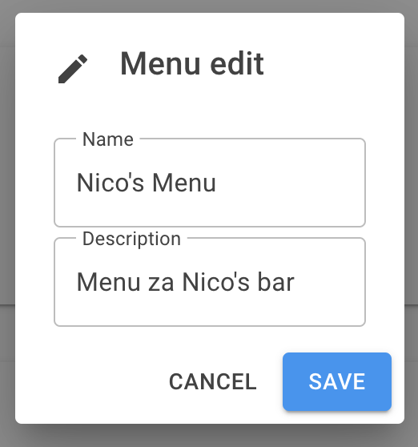

Slika 10. Kartica za uređivanje cjenika

Moguće je promijeniti ime te opis cjenika. Pritiskom na gumb “CANCEL“ prekidaju se i poništavaju sve promjene dok se pritiskom na gumb “SAVE“ promjene pohranjuju.

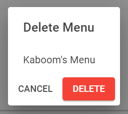

Slika 11. Kartica za brisanje cjenika

Na kartici za brisanje cjenika nalazi se naziv cjenika, i dva gumba - CANCEL kojim se odustaje od brisanja cjenika  i DELETE. Pritiskom desnim klikom miša na gumb DELETE izbriše se tj cjenik.

#### 3.4.4. Upravljanje i uređivanje pojedinačnog cjenika
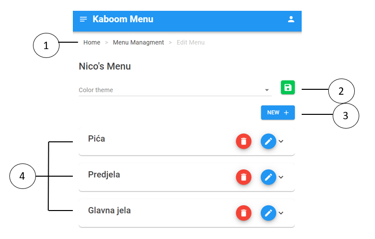

Slika 12. Prikaz stranice Edit Menu

Na vrhu stranice se nalazi niz poveznica koje opisuju put do trenutne stranice (1). Ispod se nalazi opcija mijenjana palete boja tog cjenika (2) (Slika 13.) gdje korisnik može birati između 17 opcija koje smo mi već sastavili. Pored se nalazi gumb za spremanje promjena. Ispod se nalazi gumb NEW (3) kojim je omogućeno dodavnaje nove kategorije (Slika 14.) ili artikla (Slika 15.). 

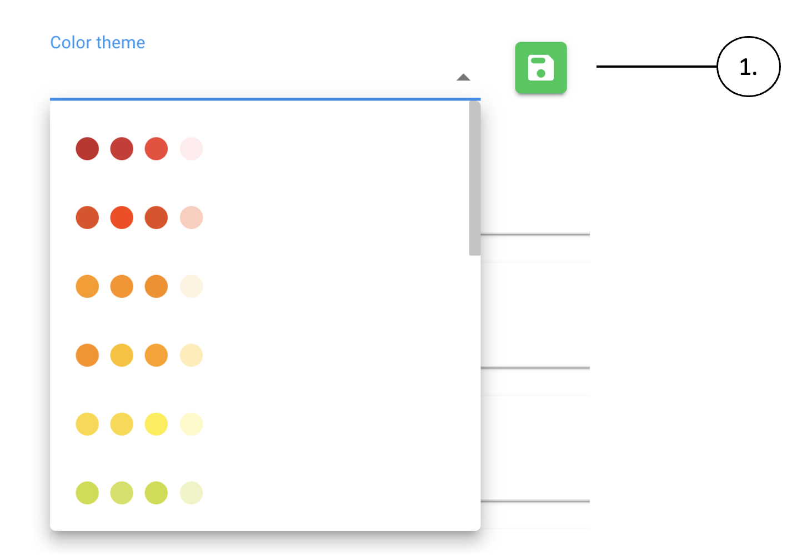

Slika 13. Palete boja

Nakon odabira jedne palete boja, pritiskom na gumb (1), sprema se primjenjena promjena te se mijenja izgled cjenika koji se prikazuje posjetiteljima ugostiteljskog objekta.

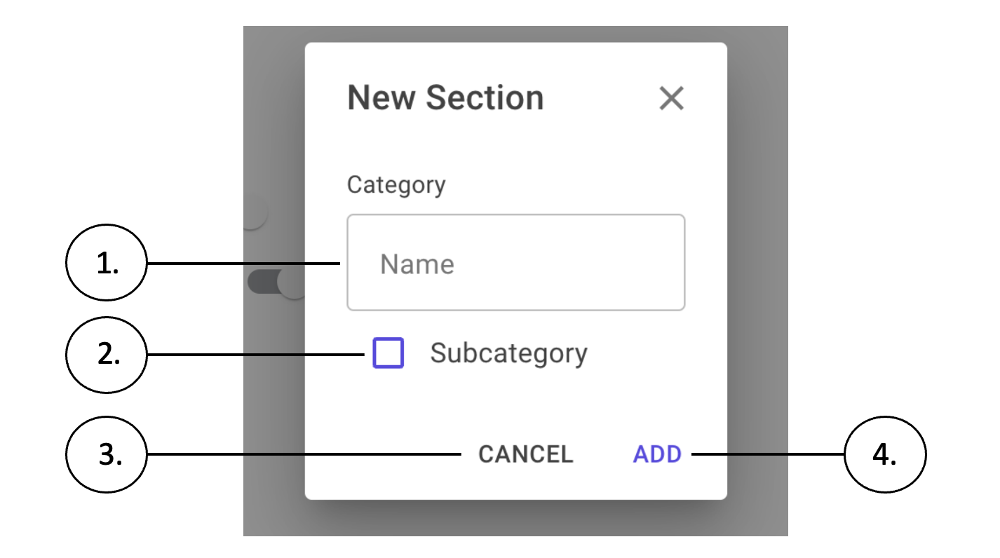

Slika 14. Nova kategorija

Kartica za stvaranje nove kategorije sastoji se od jednog polja za ispunjavanje NAME(1) u koje se upisuje ime nove kategorije te polja SUBCATEGORY(2) koje se označava pritiskom lijevog klika na kvačicu kako bi se označilo da će nova kategorija biti potkategorija neke druge kategorije(što mijenja opcije na izborniku pod “Category”). Na dnu kartice nalazi se gumb: ADD(4) koji pritiskom lijevog klika stvara i dodaje novu kategoriju.

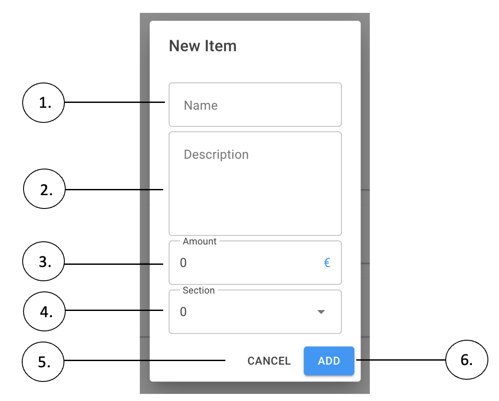

Slika 15. New item(Novi artikl)

Kartica za stvaranje novog artikla sastoji se od četiri polja za ispunjavanje. NAME(1) je polje u koje se upisuje ime novog artikla, DESCRIPTION(2) je polje u koje se upisuje detaljni opis artikla(može uključivati sastojke, količine, alergene…), AMOUNT(3) je polje u koje se upisuje cijena artikla(u eurima), a SECTION(4) je polje koje se otvara pritiskom lijevog klika i pokazuje sve kategorije/potkategorije u koju se artikl može smjestiti pri stvaranju. Na dnu kartice nalaze se dva gumba: CANCEL(5) koji pritiskom lijevog klika prekida stvaranje novog artikla te ADD(6) koji pritiskom lijevog klika stvara i dodaje novi artikl u odabranu kategoriju/potkategoriju. 

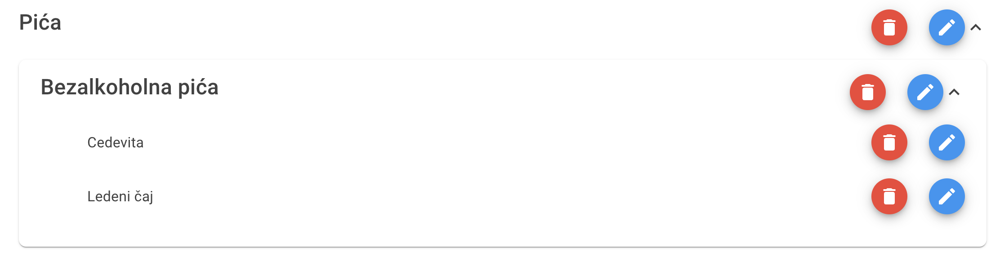

Slika 16. Sučelje

Ispod navedenih gumbiju nalazi se popis svih dodanih kategorija i potkategorija sa svim dodanim artiklima. Pokraj svake kategorije/potkategorije/artikla nalazi se gumb za brisanje(označen crvenom bojom i slikom kante za smeće, Slika 17.) te gumb za uređivanje(označen plavom bojom i slikom olovke, Slika 18.) navedenog.

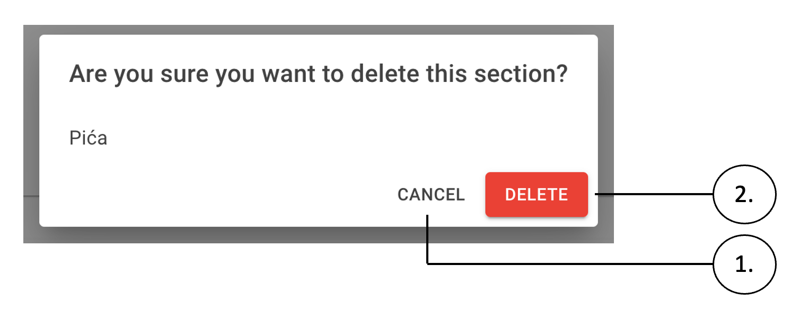

Slika 17. Kartica za brisanje kategorije/potkategorije/artikla

Na dnu kartice nalaze se dva gumba: “CANCEL”(1) koji pritiskom lijevog klika prekida brisanje kategorije/potkategorije/artikla te “DELETE” koji pritiskom lijevog klika briše odabranu kategoriju/potkategoriju/artikl. 

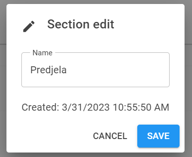

Slika 18. Kartica za uređivanje kategorije/podkategorije

Na kartici za uređivanje kategorije/podkategorije omogućeno je mijenjanje imena kategorije/podkategorije i prikaz datuma i vremena kada je kategorija napravljena. Ispod se nalaze gumbi CANCEL za odustanje i SAVE za spremanje promjena.

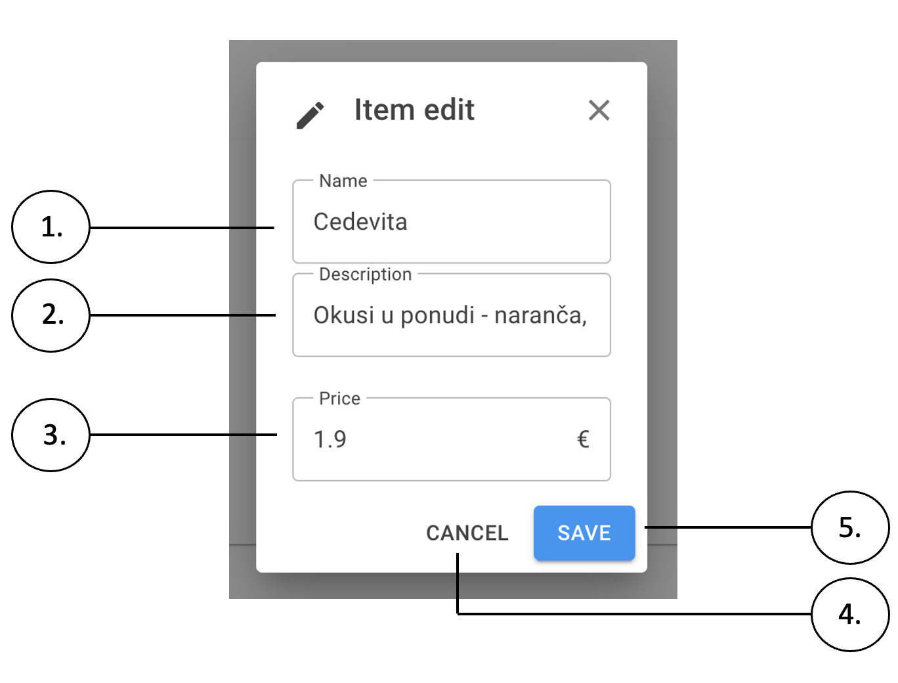

Slika 19. Kartica za uređivanje artikla

Kartica za uređivanje artikla (Slika 19.) sastoji se od tri polja za ispunjavanje. “Name“(1) je polje u kojemu se može promijeniti ime artikla, “Description“(2) je polje u kojemu se može promijeniti opis artikla, a “Price“(3) je polje u kojemu se može promijeniti cijena artikla (u eurima). Na dnu kartice nalaze se dva gumba: “CANCEL”(4) koji pritiskom lijevog klika prekida promjene te “SAVE”(5) koji pritiskom lijevog klika sprema promjene. 

#### 3.4.5. Menu
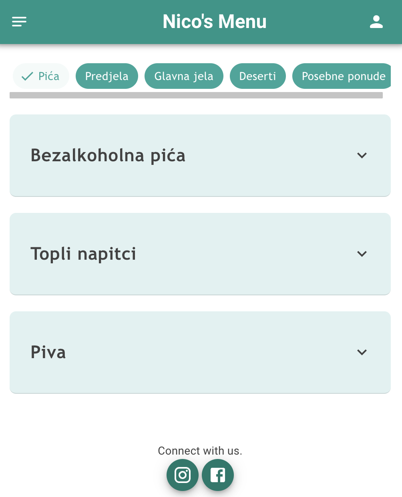

Slika 20. Prikaz cjenika
 
Na vrhu stranice prikazanog cjenika(Slika 20.) nalazi se set čipova koji prikazuju glavne kategorije izbornika. Odabirom željenog čipa prikazuju se potkategorije unutar kojih se nalaze artikli. Pokraj odabranog čipa nalazi se oznaka kvačice. 

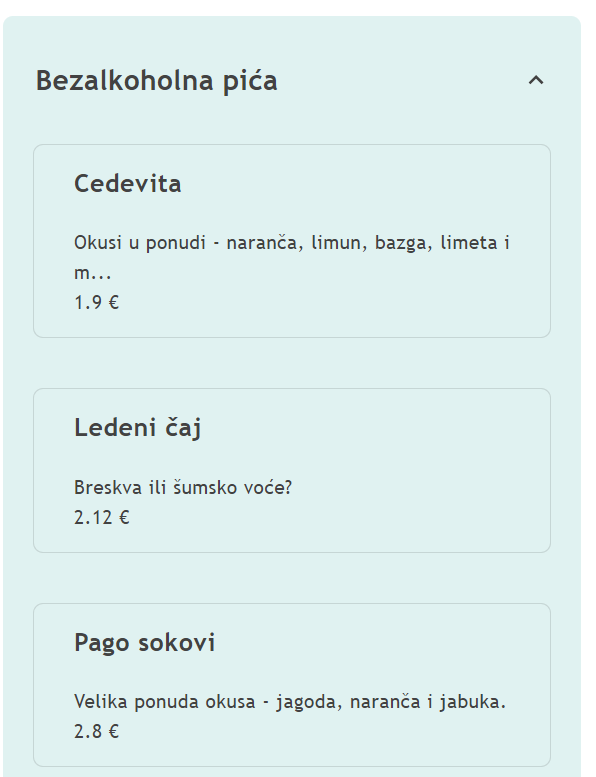

Slika 21. Prikaz artikala 

Pritiskom na željenu potkategoriju, otvara se niz artikala (Slika 21.). Svaki artikl je prikazan u svojoj kutiji. Može se vidjeti ime artikla, kratki opis i cijena. Za detaljniji opis potrebno je pritisnuti karticu željenog artikla (Slika 22.).

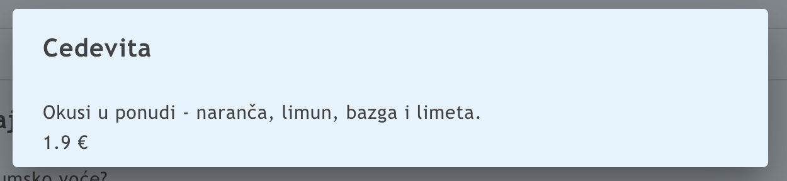

Slika 22. Opis artikla

Nakon odabira artikla otvorit će se prozor u kojem je vidljivo ime, dulji opis artikla te njegova cijena.

## 4. Izvedba projekta
### 4.1. Korišteni alati i tehnologije
Projekt smo pisali u programskom jeziku C# u framework-u Blazor. Za organizaciju projekta koristili smo Atlassian Jiru, a za pisanje dokumenata Confluence. U fazi dizajna imali smo skice na papiru s dizajnima koje smo detaljnije razradili u Figma alatu. Kao pomoć pri dizajniranju sučelja, koristili smo frontend component library Mudblazor.  U početku smo koristili Docker za lokalnu SQL bazu podataka, koju smo kasnije prebacili na Azure SQL bazu podataka. Od početka smo koristili Auth0 servis za autentifikaciju i autorizaciju koji nam je olakšao proces kreiranja korisničkih računa. Za verzioniranje koda koristili smo git i GitHub, te kada bismo došli do neke verzije koju bi trebalo testirati, koristili smo Azure App Service za deploy.

 

 

### 4.2. Arhitektira i implementacija projekta
#### 4.2.1. Baza podataka
Za bazu podataka koristili smo SQL Server, najviše zbog jednostavnosti implementiranja s Entity Framework Core-om te zato što je najjeftinija opcija na Azure-u. Budući da nam je cijela aplikacija Microsoft oriented MsSQL se činio najboljom opcijom.

#### 4.2.2. ViewModel 
MVVM arhitektura je nešto kompliciranija za implementaciju, većinom zato što nije standardna i često korištena kao sto je MVC. Odabrali smo koristiti ViewModele za aplikaciju zbog toga što bi takav backend bio znatno jednostavniji za povezivanje s frontendom aplikacija drugih platformi, ne samo web-a. Većinom smo razmišljali u smjeru kreiranja mobilne aplikacije nekad u budućnosti, a .NET Maui se čini kao odličan kandidat za takvo nešto. Upravo za to će nam MVVM arhitektura uvelike olakšati buduće pothvate.

Dijagram view modela

## 5. Zaključak
Aplikacija je trenutno namijenjena za stvaranje online cjenika dostupnog svim posjetiteljima ugostiteljskih objekata. Korisnik je u mogućnosti stvoriti vlastiti cjenik za ugostiteljski objekt te uređivati ga i ažurirati u trenutku. U skorijoj budućnosti planiramo omogućiti naručivanje za stol, prikazivanje narudžbi ugostiteljskom objektu te ostvariti mogućnost plaćanja putem mobilnih telefona putem internetskog bankarstva. Također, daljnjim razvojem aplikacije, planiramo i pokrenuti promocije na društvenim mrežama kako bi aplikacija KaboomMenu privukla širu publiku.

 